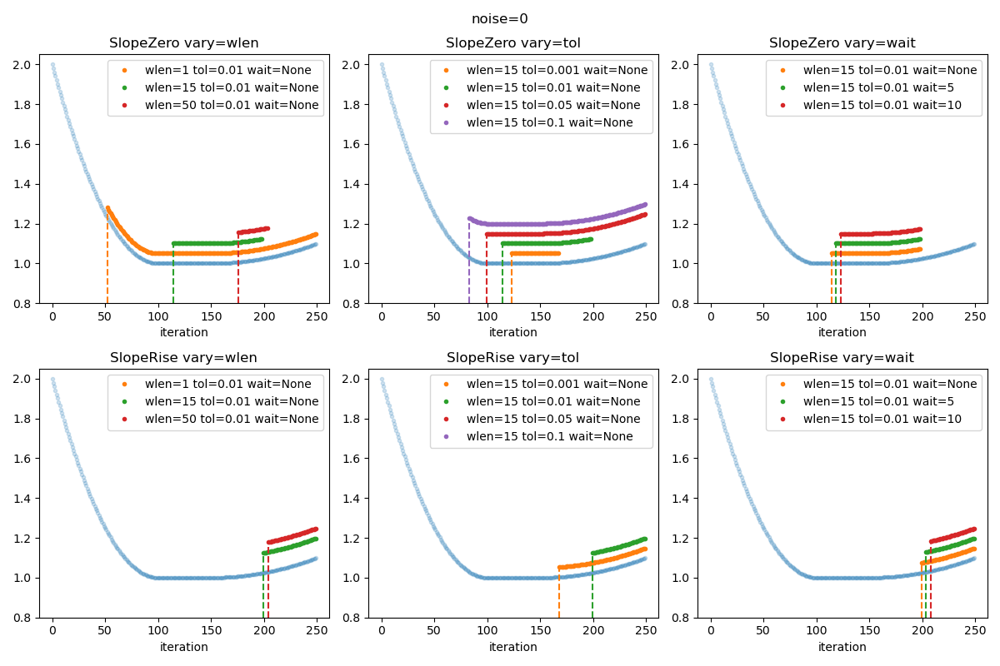
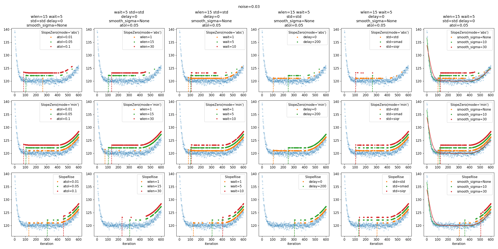

# nmbx

nmbx, NuMBoX, n_umb_ox, $n_umb_ox$

Random collection of tools that deal with numbers.

# Content

## Convergence tests

In `nmbx.convergence` we have two super simple tools for testing convergence in
a sequence of numbers (context is the loss when training machine learning
models). Losses are often noisy (e.g. when using stochastic optimizers), so we
have the option to smooth them by using a moving average.

`SlopeZero` detects a flat plateau, while `SlopeRise` is your good old buddy
early stopping, i.e. detect a rise in values after a plateau, only with
additional noise filtering.

The idea is to call either in a training loop, passing a history of loss
values.

Examples:

```py
from nmbx.convergence import SlopeRise

# Early stopping with wait=10 iterations of patience, a tolerance of 0.01 and a
# moving average window of 25 points.
conv = SlopeRise(wlen=25, tol=0.01, wait=10)

history = []
while True:
    loss = compute_loss(model, data)
    history.append(loss)
    if conv.check(history):
        print("converged")
        break
```

`wlen=1` means a window of one, so no noise filtering. In case of `SlopeRise`,
this is the traditional early stopping. For more on convergence detection, check
the nice [`EarlyStopping.jl`](https://github.com/JuliaAI/EarlyStopping.jl)
Julia package.

Note that since we only work with a given list of numbers $y_i$ in the history,
$\Delta x=1$ in the slope $\Delta y/\Delta x$. Therefore, the `tol` parameter
is only w.r.t. $y$. Please check the doc strings for what `tol` does in each
method.

Here are some results (from `examples/convergence.py`) with noise-free and
noisy histories, where we explore the parameters `wlen`, `tol` and `wait`. Blue
points are the histories. The other points indicate when `check()` is True. The
points marked with vertical dashed lines are the *first* points where the check
is True, i.e. where you would break out of the training loop.



