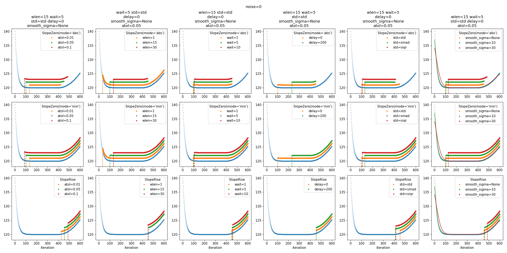

# nmbx

nmbx, NuMBoX, n_umb_ox, $n_umb_ox$

A box of tools that deal with numbers.

# Content

## Convergence tests

In `nmbx.convergence` we have two super simple tools for testing convergence in
a sequence of numbers (context is the loss when training machine learning
models).

`SlopeZero` detects a flat plateau, while `SlopeRise` is like your good old
buddy early stopping, i.e. detect a rise in values after a plateau.

The idea is to call either in a training loop, passing a history of loss
values.

Examples:

```py
from nmbx.convergence import SlopeRise

# Early stopping with wait=10 iterations of "patience", a tolerance of 0.01 and
# a moving average window of 25 points.
conv = SlopeRise(wlen=25, tol=0.01, wait=10)

history = []
while True:
    loss = compute_loss(model, data)
    history.append(loss)
    if conv.check(history):
        print("converged")
        break
```


We apply two transformations to the histories, making e.g. `SlopeRise` more
robust than vanilla "early stopping":

* noise filtering (smoothing): Losses are often noisy (e.g. when using
  stochastic optimizers), so we have the option to smooth them by using a
  moving average.

* standardization (z-score-like): By default, we standardize to zero median and
  unity standard deviation. This should give you roughly transferable
  convergence tolerances independent of the numerical scale of the history
  values. We use the median to be more robust against outliers such as short
  spikes in the history. Set `std_reduction=np.mean` for a real z-score.

`wlen=1` means a window of one, so no noise filtering. In case of `SlopeRise`,
this is the traditional early stopping. For more on convergence detection, check
the nice [`EarlyStopping.jl`](https://github.com/JuliaAI/EarlyStopping.jl)
Julia package.

Note that since we only work with a given list of numbers $y_i$ in the history,
$\Delta x=1$ in the slope $\Delta y/\Delta x$. Therefore, the `tol` parameter
is only w.r.t. $y$. Please check the doc strings for what `tol` does in each
method. In short

* `SlopeRise`: `last - tol > prev`
* `SlopeZero`: `|last - prev| < tol`

where `last` and `prev` are the mean over the last and previous non-overlapping
windows of `wlen` points each. To change the mean to, say, the median, set
`reduction=np.median`.

Here are some results (from `examples/convergence.py`) with noise-free and
noisy histories, where we explore the parameters `wlen`, `tol` and `wait`. Blue
points are the histories. The other points indicate when `check()` is True. The
points marked with vertical dashed lines are the *first* points where the check
is True, i.e. where you would break out of the training loop.



